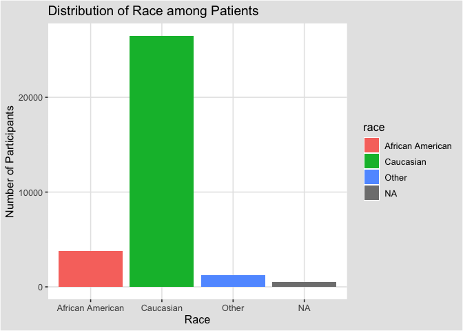
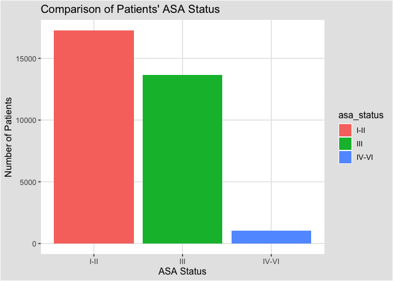
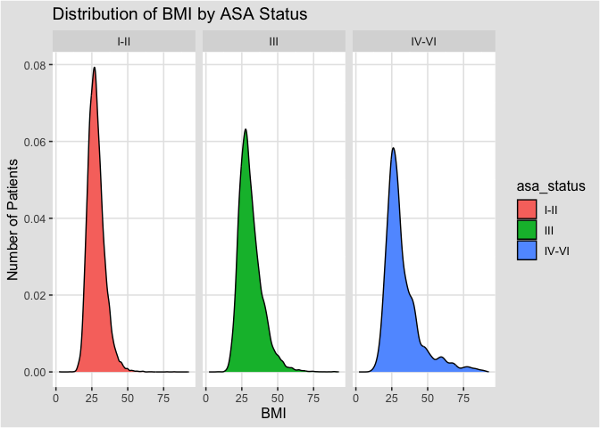

## Instructions
Answer the following questions and complete the exercises in RMarkdown. Please embed all of your code and push your final work to your repository. Your code should be organized, clean, and run free from errors. Remember, you must remove the `#` for any included code chunks to run. Be sure to add your name to the author header above.  

After the first 50 minutes, please upload your code (5 points). During the second 50 minutes, you may get help from each other- but no copy/paste. Upload the last version at the end of this time, but be sure to indicate it as final. If you finish early, you are free to leave.

Make sure to use the formatting conventions of RMarkdown to make your report neat and clean! Use the tidyverse and pipes unless otherwise indicated. To receive full credit, all plots must have clearly labeled axes, a title, and consistent aesthetics. This exam is worth a total of 35 points. 

Please load the following libraries.

```r
library("tidyverse")
library("janitor")
library("naniar")
#install.packages("ggthemes")
library(ggthemes)
```

## Data
These data are from a study on surgical residents. The study was originally published by Sessier et al. “Operation Timing and 30-Day Mortality After Elective General Surgery”. Anesth Analg 2011; 113: 1423-8. The data were cleaned for instructional use by Amy S. Nowacki, “Surgery Timing Dataset”, TSHS Resources Portal (2016). Available at https://www.causeweb.org/tshs/surgery-timing/.

Descriptions of the variables and the study are included as pdf's in the data folder.  

Please run the following chunk to import the data.

```r
surgery <- read_csv("data/surgery.csv")
```

1. (2 points) Use the summary function(s) of your choice to explore the data and get an idea of its structure. Please also check for NA's.

```r
glimpse(surgery)
```

```
## Rows: 32,001
## Columns: 25
## $ ahrq_ccs            <chr> "<Other>", "<Other>", "<Other>", "<Other>", "<Othe…
## $ age                 <dbl> 67.8, 39.5, 56.5, 71.0, 56.3, 57.7, 56.6, 64.2, 66…
## $ gender              <chr> "M", "F", "F", "M", "M", "F", "M", "F", "M", "F", …
## $ race                <chr> "Caucasian", "Caucasian", "Caucasian", "Caucasian"…
## $ asa_status          <chr> "I-II", "I-II", "I-II", "III", "I-II", "I-II", "IV…
## $ bmi                 <dbl> 28.04, 37.85, 19.56, 32.22, 24.32, 40.30, 64.57, 4…
## $ baseline_cancer     <chr> "No", "No", "No", "No", "Yes", "No", "No", "No", "…
## $ baseline_cvd        <chr> "Yes", "Yes", "No", "Yes", "No", "Yes", "Yes", "Ye…
## $ baseline_dementia   <chr> "No", "No", "No", "No", "No", "No", "No", "No", "N…
## $ baseline_diabetes   <chr> "No", "No", "No", "No", "No", "No", "Yes", "No", "…
## $ baseline_digestive  <chr> "Yes", "No", "No", "No", "No", "No", "No", "No", "…
## $ baseline_osteoart   <chr> "No", "No", "No", "No", "No", "No", "No", "No", "N…
## $ baseline_psych      <chr> "No", "No", "No", "No", "No", "Yes", "No", "No", "…
## $ baseline_pulmonary  <chr> "No", "No", "No", "No", "No", "No", "No", "No", "N…
## $ baseline_charlson   <dbl> 0, 0, 0, 0, 0, 0, 2, 0, 1, 2, 0, 1, 0, 0, 0, 0, 0,…
## $ mortality_rsi       <dbl> -0.63, -0.63, -0.49, -1.38, 0.00, -0.77, -0.36, -0…
## $ complication_rsi    <dbl> -0.26, -0.26, 0.00, -1.15, 0.00, -0.84, -1.34, 0.0…
## $ ccsmort30rate       <dbl> 0.0042508, 0.0042508, 0.0042508, 0.0042508, 0.0042…
## $ ccscomplicationrate <dbl> 0.07226355, 0.07226355, 0.07226355, 0.07226355, 0.…
## $ hour                <dbl> 9.03, 18.48, 7.88, 8.80, 12.20, 7.67, 9.53, 7.52, …
## $ dow                 <chr> "Mon", "Wed", "Fri", "Wed", "Thu", "Thu", "Tue", "…
## $ month               <chr> "Nov", "Sep", "Aug", "Jun", "Aug", "Dec", "Apr", "…
## $ moonphase           <chr> "Full Moon", "New Moon", "Full Moon", "Last Quarte…
## $ mort30              <chr> "No", "No", "No", "No", "No", "No", "No", "No", "N…
## $ complication        <chr> "No", "No", "No", "No", "No", "No", "No", "Yes", "…
```

```r
anyNA(surgery)
```

```
## [1] TRUE
```

```r
naniar::miss_var_summary(surgery)
```

```
## # A tibble: 25 × 3
##    variable          n_miss pct_miss
##    <chr>              <int>    <dbl>
##  1 bmi                 3290 10.3    
##  2 race                 480  1.50   
##  3 asa_status             8  0.0250 
##  4 gender                 3  0.00937
##  5 age                    2  0.00625
##  6 ahrq_ccs               0  0      
##  7 baseline_cancer        0  0      
##  8 baseline_cvd           0  0      
##  9 baseline_dementia      0  0      
## 10 baseline_diabetes      0  0      
## # … with 15 more rows
```

2. (3 points) Let's explore the participants in the study. Show a count of participants by race AND make a plot that visually represents your output.

```r
surgery %>% 
tabyl(race) 
```

```
##              race     n    percent valid_percent
##  African American  3790 0.11843380    0.12023730
##         Caucasian 26488 0.82772413    0.84032867
##             Other  1243 0.03884254    0.03943403
##              <NA>   480 0.01499953            NA
```


```r
surgery %>% 
  ggplot(aes(x=race,fill=race))+geom_bar()+labs(title ="Distribution of Race among Patients",x="Race", y="Number of Participants")+theme(plot.title = element_text(hjust =0.5))+theme_igray()
```

<!-- -->

3. (2 points) What is the mean age of participants by gender? (hint: please provide a number for each) Since only three participants do not have gender indicated, remove these participants from the data.

```r
surgery %>% 
  group_by(gender) %>% 
  filter(gender == "M"|gender =="F") %>% 
  summarise(mean_age = mean(age, na.rm =T))
```

```
## # A tibble: 2 × 2
##   gender mean_age
##   <chr>     <dbl>
## 1 F          56.7
## 2 M          58.8
```

4. (3 points) Make a plot that shows the range of age associated with gender.

```r
surgery %>% 
  group_by(gender) %>% 
  filter(gender == "M"|gender =="F") %>% 
  ggplot(aes(x=age, fill=gender))+geom_boxplot()+facet_wrap(~gender)+labs(title="Ranges of Age divided by Gender",y= "Number of Individuals",x="Age of Individuals")+theme(plot.title = element_text(hjust =0.5))+coord_flip()+theme_igray()
```

```
## Warning: Removed 2 rows containing non-finite values (`stat_boxplot()`).
```

<!-- -->

5. (2 points) How healthy are the participants? The variable `asa_status` is an evaluation of patient physical status prior to surgery. Lower numbers indicate fewer comorbidities (presence of two or more diseases or medical conditions in a patient). Make a plot that compares the number of `asa_status` I-II, III, and IV-V.  

```r
surgery %>% 
  filter(asa_status == "I-II"|asa_status == "III"|asa_status == "IV-VI") %>%
  ggplot(aes(x=asa_status, fill=asa_status))+geom_bar()+labs(title="Comparison of Patients' ASA Status",x="ASA Status",y="Number of Patients")+theme(plot.title = element_text(hjust =0.5))+theme_igray()##+labs(title="",x="",y="")+theme(plot.title = element_text(hjust =0.5))
```

<!-- -->

6. (3 points) Create a plot that displays the distribution of body mass index for each `asa_status` as a probability distribution- not a histogram. (hint: use faceting!)

```r
surgery %>% 
  filter(asa_status == "I-II"|asa_status == "III"|asa_status == "IV-VI") %>% 
  ggplot(aes(x=bmi, fill=asa_status))+geom_density()+facet_wrap(~asa_status, ncol = 3)+labs(title="Distribution of BMI by ASA Status",x="BMI",y="Number of Patients")+theme(plot.title = element_text(hjust =0.5))+theme_igray()
```

```
## Warning: Removed 3289 rows containing non-finite values (`stat_density()`).
```

<!-- -->

The variable `ccsmort30rate` is a measure of the overall 30-day mortality rate associated with each type of operation. The variable `ccscomplicationrate` is a measure of the 30-day in-hospital complication rate. The variable `ahrq_ccs` lists each type of operation.  

7. (4 points) What are the 5 procedures associated with highest risk of 30-day mortality AND how do they compare with the 5 procedures with highest risk of complication? (hint: no need for a plot here)

```r
surgery %>% 
  group_by(ahrq_ccs) %>% 
  summarize(mean_mort_rate = mean(ccsmort30rate, na.rm=T)) %>% 
  arrange(desc(mean_mort_rate)) %>% 
  slice_max(mean_mort_rate, n=5)
```

```
## # A tibble: 5 × 2
##   ahrq_ccs                                             mean_mort_rate
##   <chr>                                                         <dbl>
## 1 Colorectal resection                                        0.0167 
## 2 Small bowel resection                                       0.0129 
## 3 Gastrectomy; partial and total                              0.0127 
## 4 Endoscopy and endoscopic biopsy of the urinary tract        0.00811
## 5 Spinal fusion                                               0.00742
```

```r
surgery %>% 
  group_by(ahrq_ccs) %>% 
  summarize(mean_comp_rate = mean(ccscomplicationrate, na.rm=T)) %>% 
  arrange(desc(mean_comp_rate)) %>% 
  slice_max(mean_comp_rate, n=5)
```

```
## # A tibble: 5 × 2
##   ahrq_ccs                         mean_comp_rate
##   <chr>                                     <dbl>
## 1 Small bowel resection                     0.466
## 2 Colorectal resection                      0.312
## 3 Nephrectomy; partial or complete          0.197
## 4 Gastrectomy; partial and total            0.190
## 5 Spinal fusion                             0.183
```

```r
##The mortality rate and complication rate are very different statistically; however, both are highest in the mostly the same procedures.
```

8. (3 points) Make a plot that compares the `ccsmort30rate` for all listed `ahrq_ccs` procedures.

```r
surgery %>% 
  ggplot(aes(x=ahrq_ccs,y=ccsmort30rate))+geom_col()+labs(title="Distribution of Mortality Rate by Procedure",x="Type of Procedure",y="Mortality Rate")+theme(plot.title = element_text(hjust =0.5), axis.text.x=element_text(angle=60, size =5))
```

<!-- -->

9. (4 points) When is the best month to have surgery? Make a chart that shows the 30-day mortality and complications for the patients by month. `mort30` is the variable that shows whether or not a patient survived 30 days post-operation.

```r
surgery %>% 
  group_by(month) %>% 
  filter(mort30 =="Yes") %>% #|complication =="Yes"
 count(mort30) %>% #, complication
  arrange(n)
```

```
## # A tibble: 12 × 3
## # Groups:   month [12]
##    month mort30     n
##    <chr> <chr>  <int>
##  1 Dec   Yes        4
##  2 Nov   Yes        5
##  3 Oct   Yes        8
##  4 Aug   Yes        9
##  5 May   Yes       10
##  6 Apr   Yes       12
##  7 Jul   Yes       12
##  8 Mar   Yes       12
##  9 Jun   Yes       14
## 10 Sep   Yes       16
## 11 Feb   Yes       17
## 12 Jan   Yes       19
```


```r
surgery %>% 
  group_by(month) %>% 
  filter(complication =="Yes") %>% #|complication =="Yes"
 count(complication) %>% #, complication
  arrange(n)##Have a surgery in December. That's when fewest folk died after surgery.
```

```
## # A tibble: 12 × 3
## # Groups:   month [12]
##    month complication     n
##    <chr> <chr>        <int>
##  1 Dec   Yes            237
##  2 Jul   Yes            301
##  3 Apr   Yes            321
##  4 Mar   Yes            324
##  5 Nov   Yes            325
##  6 May   Yes            333
##  7 Feb   Yes            343
##  8 Oct   Yes            377
##  9 Jan   Yes            407
## 10 Jun   Yes            410
## 11 Sep   Yes            424
## 12 Aug   Yes            462
```


10. (4 points) Make a plot that visualizes the chart from question #9. Make sure that the months are on the x-axis. Do a search online and figure out how to order the months Jan-Dec.

```r
surgery %>% 
  filter(mort30 =="Yes") %>% 
  ggplot(aes(x=month, y=mort30, fill=month))+geom_col()+ scale_x_discrete(limits = month.abb)+labs(title="Distribution of Post-Surgery Mortality by Month",x="Month",y="Number of Mortalities")+theme(plot.title = element_text(hjust =0.5))+theme_igray()
```

<!-- -->

```r
surgery %>% 
  filter(complication =="Yes") %>% 
  ggplot(aes(x=month, y=complication, fill=month))+geom_col()+ scale_x_discrete(limits = month.abb)+labs(title="Distribution of Post-Surgery Complication by Month",x="Month",y="Number of Complications")+theme(plot.title = element_text(hjust =0.5))+theme_igray()
```

<!-- -->

Please provide the names of the students you have worked with with during the exam:

Please be 100% sure your exam is saved, knitted, and pushed to your github repository. No need to submit a link on canvas, we will find your exam in your repository.
